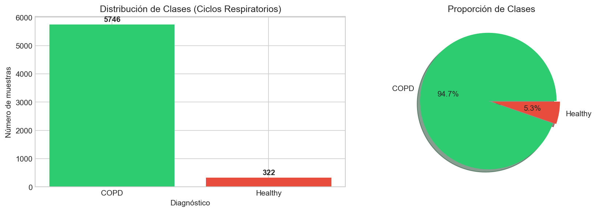
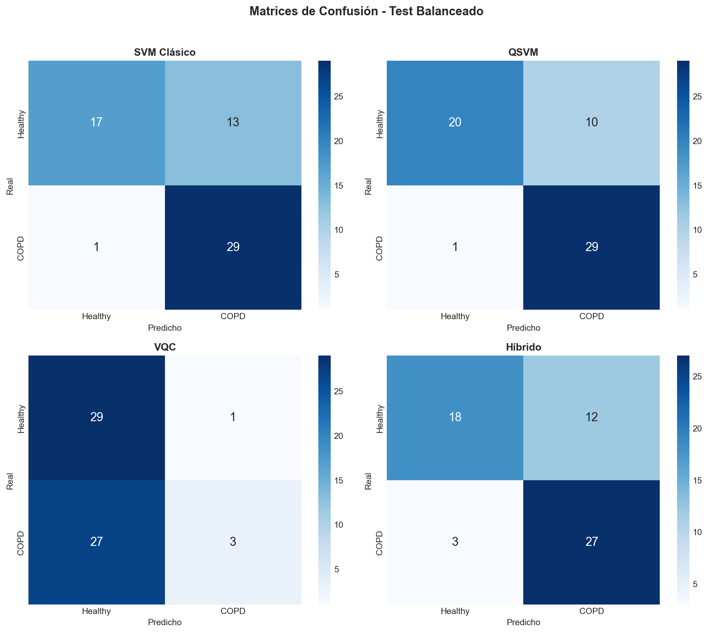

# Clasificación Cuántica de Sonidos Respiratorios

## Detección de EPOC mediante Aprendizaje Automático Cuántico

---

**Autor:** Alejandro Moris Lara  
---

### Resumen

Este trabajo presenta un estudio comparativo de técnicas de Aprendizaje Automático Cuántico (QML) para la clasificación binaria de sonidos respiratorios, distinguiendo entre pacientes sanos y pacientes con Enfermedad Pulmonar Obstructiva Crónica (EPOC). Se implementan y evalúan tres enfoques cuánticos: Quantum Support Vector Machines (QSVM), Redes Neuronales Cuánticas (QNN) y redes híbridas cuántico-clásicas, comparándolos con un baseline clásico basado en SVM.

---

### Tabla de Contenidos

1. [Introducción](#1-introducción)
2. [Objetivos](#2-objetivos)
3. [Selección y Estudio del Dataset](#3-selección-y-estudio-del-dataset)
4. [Preparación de los Datos](#4-preparación-de-los-datos)
5. [Modelos de Clasificación](#5-modelos-de-clasificación)
6. [Resultados](#6-resultados)
7. [Conclusiones](#7-conclusiones)
8. [Estructura del Proyecto](#8-estructura-del-proyecto)
9. [Instalación y Uso](#9-instalación-y-uso)

---

## 1. Introducción

La Enfermedad Pulmonar Obstructiva Crónica (EPOC) representa uno de los principales desafíos de salud pública a nivel mundial, siendo la tercera causa de muerte según la Organización Mundial de la Salud. El diagnóstico temprano es fundamental para mejorar el pronóstico de los pacientes.

El Aprendizaje Automático Cuántico (QML) emerge como un paradigma prometedor que combina las capacidades del aprendizaje automático clásico con las propiedades únicas de la computación cuántica, como la superposición y el entrelazamiento.

Este trabajo explora la aplicación de tres técnicas de QML para la clasificación automática de sonidos respiratorios:

- **Quantum Support Vector Machines (QSVM)**
- **Redes Neuronales Cuánticas (QNN)**
- **Redes Híbridas Cuántico-Clásicas**

---

## 2. Objetivos

### Objetivo General

Desarrollar y evaluar modelos de clasificación cuántica para la detección automática de EPOC a partir del análisis de sonidos respiratorios, comparando su rendimiento con técnicas de aprendizaje automático clásico.

### Objetivos Específicos

1. Preparar y analizar el conjunto de datos de sonidos respiratorios
2. Implementar un clasificador QSVM con kernel cuántico
3. Desarrollar una Red Neuronal Cuántica (QNN)
4. Crear una red híbrida cuántico-clásica
5. Realizar una comparativa rigurosa de todos los modelos

---

## 3. Selección y Estudio del Dataset

### Procedencia de los Datos

Se utiliza el **ICBHI 2017 Respiratory Sound Database**, disponible en [Kaggle](https://www.kaggle.com/datasets/vbookshelf/respiratory-sound-database). Este dataset contiene grabaciones de sonidos respiratorios adquiridos mediante estetoscopios digitales.

### Descripción del Dataset

| Característica | Valor |
|---------------|-------|
| Total de archivos de audio | 920 |
| Número de pacientes | 126 (90 utilizados) |
| Diagnósticos | Healthy, COPD |
| Muestras totales | 6,068 ciclos respiratorios |
| Frecuencia de muestreo | 4000-44100 Hz |

### Análisis Exploratorio

El dataset presenta un **desbalance severo de clases** con un ratio aproximado de 18:1 entre pacientes con EPOC y sujetos sanos.



---

## 4. Preparación de los Datos

### 4.1 Extracción de Características

Se extraen características acústicas basadas en **Coeficientes Cepstrales en las Frecuencias de Mel (MFCC)**:

| Tipo de característica | Cantidad |
|----------------------|----------|
| MFCC (media) | 13 |
| MFCC (std) | 13 |
| Delta MFCC (media) | 13 |
| Delta MFCC (std) | 13 |
| **Total** | **52** |

### 4.2 Reducción de Dimensionalidad

Se aplica **PCA** para reducir las 52 características originales a **8 componentes principales**, correspondientes al número de qubits del circuito cuántico.

### 4.3 División de Datos por Pacientes

Se implementa una **división estratificada por pacientes** (80% train / 20% test) para evitar fuga de información.

### 4.4 Tratamiento del Desbalance de Clases

Se emplea **SMOTE** (Synthetic Minority Over-sampling Technique) para balancear las clases mediante sobremuestreo sintético de la clase minoritaria.

---

## 5. Modelos de Clasificación

### 5.1 Baseline Clásico: SVM

Support Vector Machine con kernel RBF optimizado mediante GridSearchCV.

### 5.2 Quantum Support Vector Machine (QSVM)

- Kernel cuántico basado en **AngleEmbedding**
- 8 qubits (1 por feature)
- Proyector sobre estado |0⟩^⊗n

### 5.3 Red Neuronal Cuántica (QNN)

- Circuito variacional con **StronglyEntanglingLayers**
- 8 qubits, 2 capas
- Optimizador: Adam (lr=0.01)
- 50 epochs

### 5.4 Red Híbrida Cuántico-Clásica

- Dense(16) → ReLU
- Capa cuántica (4 qubits, 2 capas)
- Dense(1) → Sigmoid
- Optimizador: Adam (lr=0.001)
- 30 epochs

---

## 6. Resultados

### Comparativa de Modelos por Métrica


### Curvas ROC


### Matrices de Confusión



### Tiempos de Entrenamiento


### Tabla Resumen

| Modelo | Accuracy | Sensibilidad | Especificidad | AUC-ROC | Tiempo (s) |
|--------|----------|--------------|---------------|---------|------------|
| SVM Clásico | 0.835 | 0.823 | 0.948 | 0.952 | 3.4 |
| QSVM | 0.387 | 0.329 | 0.918 | 0.736 | 1,062 |
| QNN | 0.464 | 0.453 | 0.557 | 0.509 | 5,813 |
| Híbrido | 0.780 | 0.768 | 0.897 | 0.918 | 604 |

---

## 7. Conclusiones

- El **SVM clásico** obtiene el mejor rendimiento en todas las métricas (AUC = 0.952)
- El **modelo híbrido** es el mejor enfoque cuántico (AUC = 0.918), solo 3.4 puntos por debajo del clásico
- El **QSVM** presenta comportamiento sesgado hacia la clase mayoritaria
- La **QNN** muestra rendimiento cercano al aleatorio (AUC ≈ 0.5)
- Los modelos cuánticos requieren tiempos de entrenamiento significativamente mayores (hasta 1700x más)
- El desbalance de clases (18:1) afecta especialmente a los modelos cuánticos puros

---

## 8. Estructura del Proyecto

```
Respiratory_Sound_Database/
├── config/
│   ├── paths.py                 # Rutas del proyecto
│   └── settings.py              # Hiperparámetros
├── data/
│   └── processed/
│       └── features.csv         # Features extraídas
├── notebooks/
│   └── 01_main.ipynb            # Notebook principal
├── results/
│   └── figures/                 # Visualizaciones
├── src/
│   ├── circuits/
│   │   └── circuits.py          # Circuitos cuánticos
│   ├── data/
│   │   ├── loader.py
│   │   └── splitter.py          # División por pacientes
│   ├── evaluation/
│   │   └── metrics.py           # Métricas médicas
│   ├── features/
│   │   ├── balancing.py         # SMOTE
│   │   ├── extractor.py         # Extracción MFCCs
│   │   └── reducer.py           # PCA
│   └── models/
│       ├── classical.py         # SVM
│       ├── qsvm.py              # Quantum SVM
│       ├── qnn.py               # Red Neuronal Cuántica
│       └── hybrid.py            # Red Híbrida
├── audio_and_txt_files/         # Audios originales
├── patient_diagnosis.csv
├── requirements.txt
└── README.md
```

---

## 9. Instalación y Uso

### Requisitos

- Python 3.10+
- PennyLane, Scikit-learn, TensorFlow, Librosa

### Instalación

```bash
python -m venv venv
venv\Scripts\activate          # Windows
pip install -r requirements.txt
```

### Ejecución

```bash
cd notebooks
jupyter notebook 01_main.ipynb
```

---

## Referencias

- ICBHI 2017 Respiratory Sound Database
- Schuld, M., & Petruccione, F. (2021). Machine Learning with Quantum Computers
- Havlíček, V., et al. (2019). Supervised learning with quantum-enhanced feature spaces
